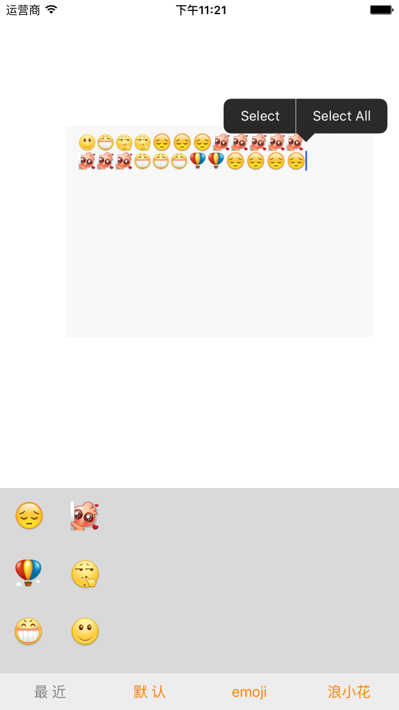
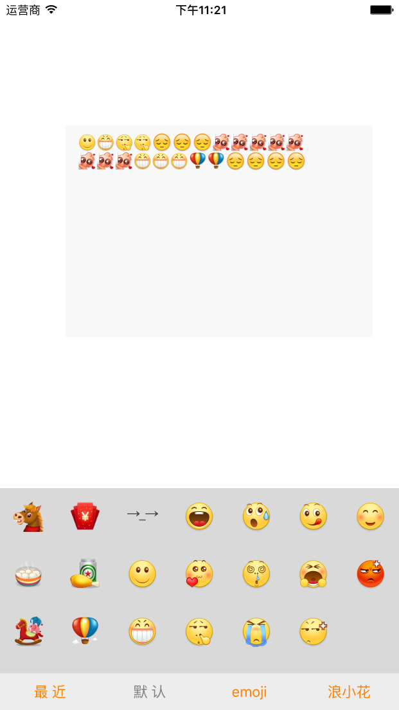
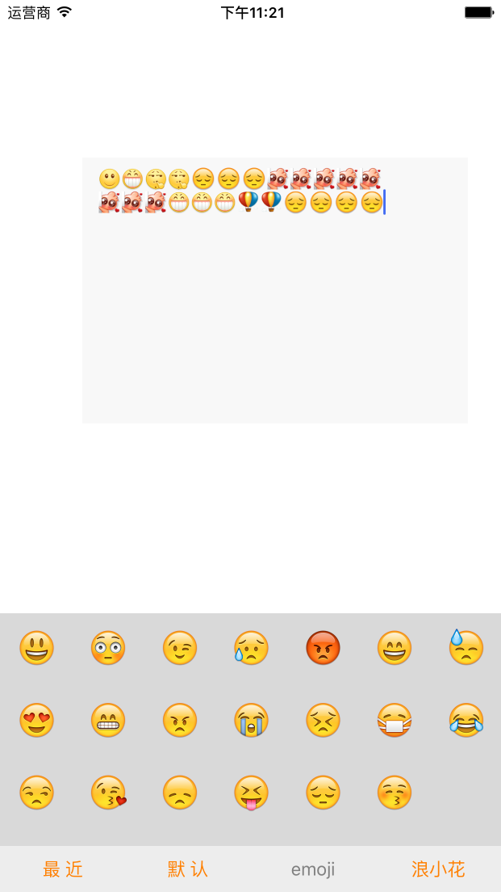
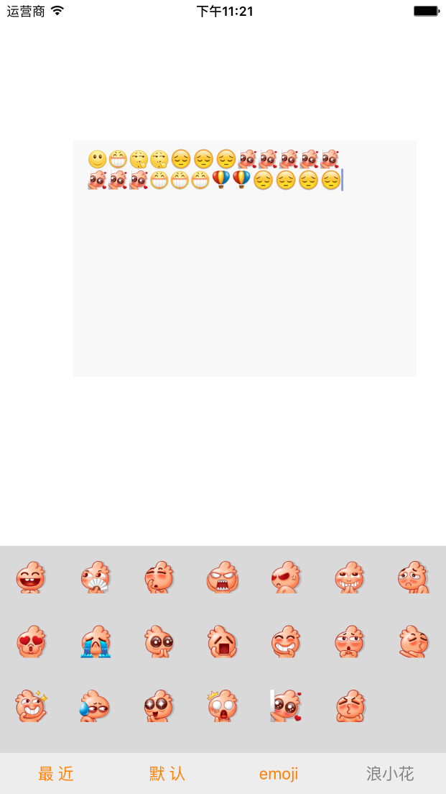

# NJKeyboard
一行代码集成表情键盘


```objc

    /* 一行代码集成表情键盘创建的时候, 告知键盘targetTextView */
   private lazy var keyboard: LMJEmoticonKeyboard = LMJEmoticonKeyboard(targetTextView: self.textView)
    /* 一行代码集成表情键盘创建的时候, 告知键盘targetTextView */

    @IBOutlet weak var textView: LMJTextView!
    
    override func viewDidLoad() {
        super.viewDidLoad()
        
        textView.inputView = keyboard
        
        textView.becomeFirstResponder()
        
    }
 ```
    
    
    
  
    
      
        